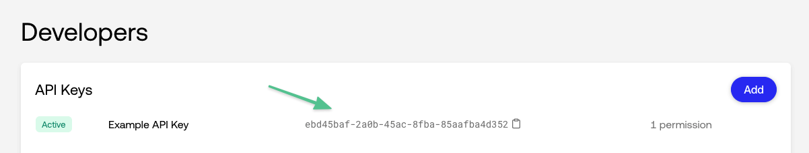
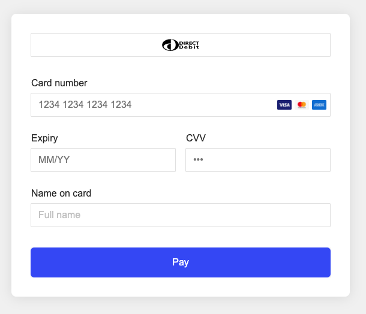

# Primer Integration Walkthrough

## Getting Started

### Installation

```bash
$ git clone git@github.com:primer-io/integration-walkthrough.git
$ cd ./integration-walkthrough
```

Install the dependencies using yarn or npm.

```bash
# With yarn
$ yarn

# With npm
$ npm i
```

### Set the environnement variables

Grab your API Key, or create a new API Key, from [Primer's dashboard](https://sandbox-dashboard.primer.io/developers).



Clone `env.example` and name the cloned file `.env`.

```
$ cp env.example .env
```

Open `.env` and set the environment variable `API_KEY` with the API key available on your dashboard.

```
API_KEY=1234-1234-1234-1234 # Your Primer API Key
```

### Run the server

```bash
# With yarn
$ yarn start

# With npm
$ npm start
```

The server is deployed on port 80 by default. You can set the port by setting the `PORT` environment variable in the `.env` file.

### Access the checkout

Check the checkout at [http://localhost/](http://localhost/).


